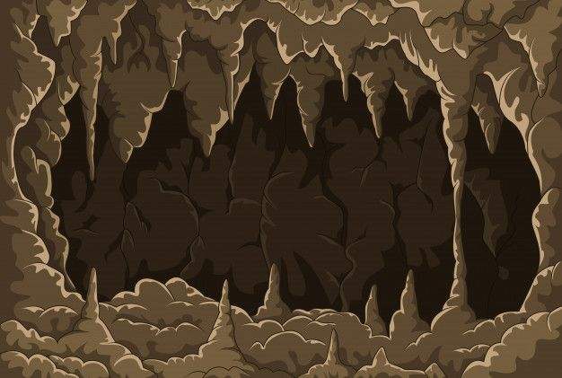

# 🕶️ Darker Graph - Explorador de Mazmorras con Grafos

Un juego de ventana donde **los grafos gobiernan todo**: potenciado por la generación procedural de mazmorras y caminos peculiares. ¡Combate enemigos, resuelve desafíos y escapa de la oscuridad! Desarrollado con la libreria de SDL2 y complementos se busca plasmar dicha aventura con un diseno en 2.5D.

  

## 🔥 Características
- **Mazmorras procedurales** 
- **Combate en tiempo real** ataques en cualquier direccion cardinal
- **Caminos Eulerianos existentes**
- **Representacion de Grafos a traves de mapas** conexos y no dirigidos
- **Muerte permanente** con registro de puntajes
- **Videojuego de escritorio con uso de Ventana**

## 🛠️ Instalación
Ubuntu: sudo apt update, 
sudo apt-get install libsdl2-dev libsdl2-ttf-dev libsdl2-image-dev

# Ejecutar
make
./DarkerGraph

